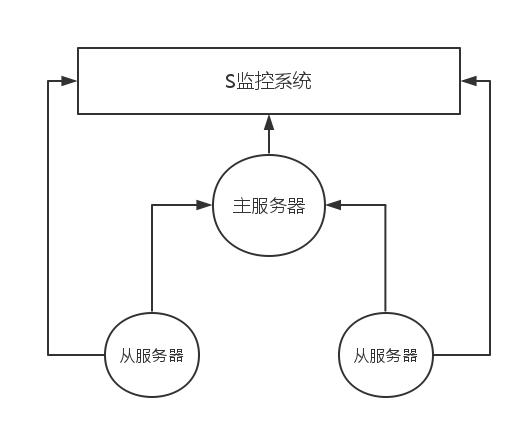
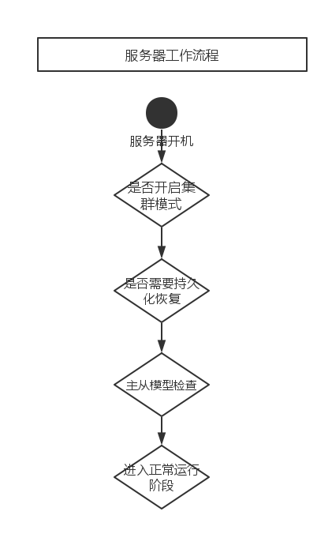
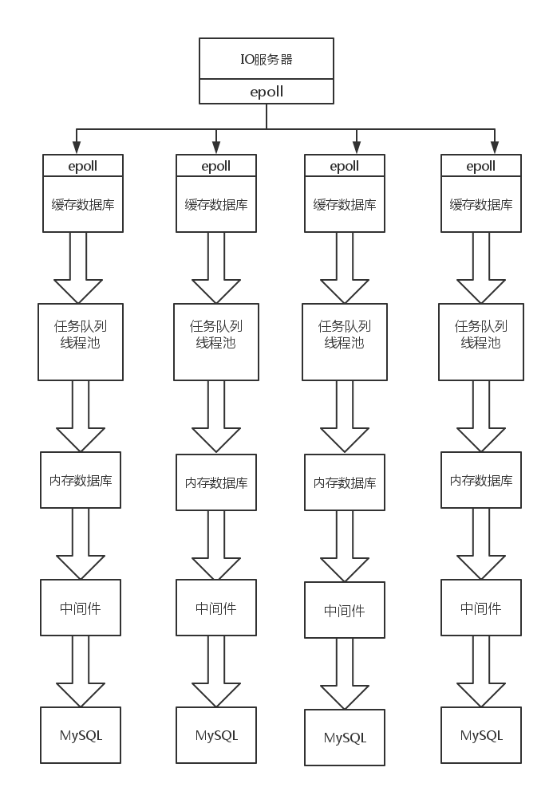

##服务器结构设计

###服务器职能

            缓存数据库服务器提供以下职能：
                @读取/写入数据信息，非关系型数据库为记录。
                @和持久化性数据库建立交互关系。
                @能够在高并发量的环境下提供正常服务。
                @作为集群节点，需要通用的结构体系。
                @主备之间需要统一的构型，方便主从转换，主备复制。
                @可以直接提供向外的服务。
                @统一不同的服务器数据格式，支持多种语言的客户端连接。
                @能够在不同环境下拆解/合并，支持升级功能。
                
###设计原则
            设计原则：
                #模块化原则，尽量向提供的库的标准靠近，尽最大可能将低耦合度。
                #清晰原则，清晰胜于机巧。
                #简单原则，尽量不使用复杂算法。
                #优化原则，过早的优化是万恶之源！
                #可扩展原则，变化总是比我们想像的来的快。
                #经济原则，暂时能可多花机器，少费人力。
                #通俗原则，接口不要标新立异。
                #调试原则，不要写无法调试的代码。
                #缄默原则，如果一个程序没什么好说的，就安静不要说话。
                #沟通原则，及时的沟通可避免不可挽回的损失。
                #系统原则，即使是不完整的结构，只要核心结构在，也可以工作。
        
###服务器架构模型
主从复制模型

         
###服务器流程模型
服务器开机进入状态模型

###服务器技术模型
这里只有大体的流程模型，服务器细节在这里没有说明。

   

   
   